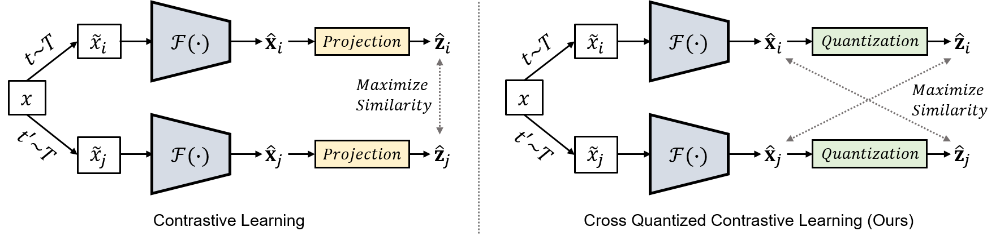
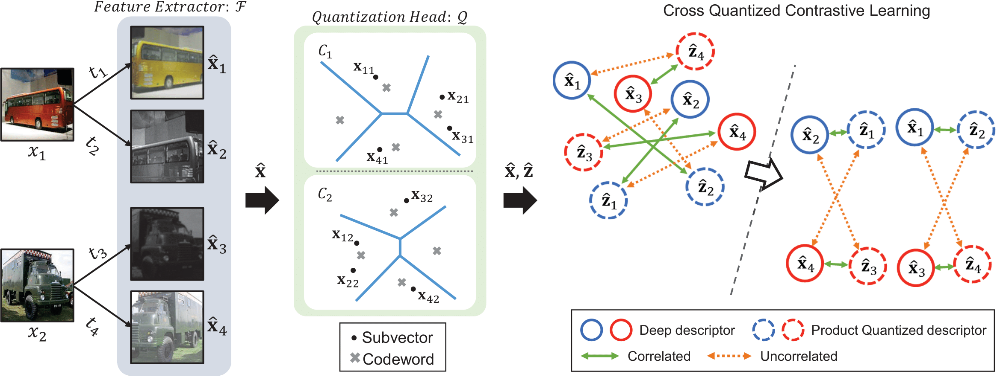

# Histopathology Image Retrieval Project-SPQ

 

Welcome to the Histopathology Image Retrieval project! This repository contains code and resources for implementing a deep learning model to perform histopathology image retrieval. The goal of this project is to develop a robust system that can retrieve relevant histopathology images based on user queries. Convolutional models, along with attention mechanisms, are employed to achieve accurate and meaningful image retrieval.

**Note:** This project is based on the research presented in the paper, "Combination of Multiple Global Descriptors for Image Retrieval"


## Table of Contents

- [Project Description](#project-description)
- [Dataset](#dataset)
- [Requirements](#requirements)
- [Usage](#usage)
- [Model Architecture](#model-architecture)

## Project Description

In the Histopathology Image Retrieval project, we tackle the task of retrieving histopathology images based on user-defined queries. Histopathology images play a crucial role in medical diagnosis and research, and efficient retrieval of relevant images can aid in accurate diagnosis and analysis. To achieve this, we have implemented a deep learning model that leverages convolutional neural networks (CNNs) and attention mechanisms. By combining these techniques, we aim to capture both local and global features within the images, enhancing the retrieval accuracy.

## Dataset

This project utilizes the following datasets:

1. **BRACS Dataset**
   - Website: [BRACS Dataset](https://www.bracs.icar.cnr.it/)
   - Description: The BRACS dataset contains a collection of histopathology images for various tissue types. It serves as a valuable resource for training and evaluating our image retrieval model.

2. **CRC Dataset**
   - Website: [CRC Dataset](https://warwick.ac.uk/fac/cross_fac/tia/data/extended_crc_grading/)
   - Description: The CRC dataset offers histopathology images related to colorectal cancer. These images contribute to the diversity of the training data and aid in building a robust retrieval system.

3. **BATCH Dataset**
   - Website: [BATCH Dataset](https://iciar2018-challenge.grand-challenge.org/Dataset/)
   - Description: The BATCH dataset is a part of the ICAR 2018 challenge and consists of histopathology images for various tasks. It provides an additional set of images for validating and testing our retrieval model.

## Requirements
- PyTorch=1.7.1
- kornia=0.5.10
- packaging=21.0
- torchvision=0.8.2
- tqdm=4.62.2
```
conda install pytorch torchvision cudatoolkit=10.0 -c pytorch
```
- thop
```
pip install thop
```

 
## Abstract

Supervised deep learning-based hash and vector quantization are enabling fast and large-scale image retrieval systems. By fully exploiting label annotations, they are achieving outstanding retrieval performances compared to the conventional methods. However, it is painstaking to assign labels precisely for a vast amount of training data, and also, the annotation process is error-prone. To tackle these issues, we propose the first deep unsupervised image retrieval method dubbed Self-supervised Product Quantization (SPQ) network, which is label-free and trained in a self-supervised manner. We design a Cross Quantized Contrastive learning strategy that jointly learns codewords and deep visual descriptors by comparing individually transformed images (views). Our method analyzes the image contents to extract descriptive features, allowing us to understand image representations for accurate retrieval. By conducting extensive experiments on benchmarks, we demonstrate that the proposed method yields state-of-the-art results even without supervised pretraining.

## Concept

<p align="center"></p>

By maximizing cross-similarity between the deep descriptor of one view and the product quantized descriptor of the other, both codewords and deep descriptors are jointly trained to contain discriminative image content representations in SPQ.

## An illustration of training procedure in SPQ

<p align="center"></p>
